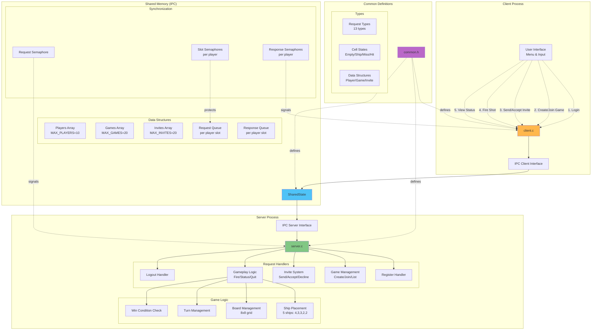

```
            ┌──────────────────────────────┐
            │           CLIENT N           │
            │      (процесс игрока)        │
            │                              │
            │   - ввод команд              │
            │   - отрисовка полей          │
            │   - отправка запросов        │
            │   - ожидание ответов         │
            └───────────────┬──────────────┘
                            │
                            │ Request[N] / Response[N]
                            │ через Shared Memory
                            ▼
┌──────────────────────────────────────────────────────────┐
│                        SHARED MEMORY                     │
│                     (mmap + shm_open)                    │
│                                                          │
│  ┌──────────────┐    ┌──────────────┐    ┌────────────┐  │
│  │ players[ ]   │    │ games[ ]     │    │ invites[ ] │  │
│  │ - active     │    │ - active     │    │ - active   │  │
│  │ - login      │    │ - players[2] │    │ - from/to  │  │
│  │ - game_id    │    │ - turn       │    │ - game_id  │  │
│  └──────────────┘    │ - ships      │    └────────────┘  │
│                      │ - boards     │                    │
│                      └──────────────┘                    │
│                                                          │
│  ┌────────────────────────────────────────────────────┐  │
│  │ requests[MAX_PLAYERS]                              │  │
│  │   - type                                           │  │
│  │   - from_slot                                      │  │
│  │   - args (x,y)                                     │  │
│  └────────────────────────────────────────────────────┘  │
│                                                          │
│  ┌────────────────────────────────────────────────────┐  │
│  │ responses[MAX_PLAYERS]                             │  │
│  │   - code / text / boards                           │  │
│  │   - winner                                         │  │
│  └────────────────────────────────────────────────────┘  │
│                                                          │
│  request_ready[MAX_PLAYERS]                              │
└───────────────────────────┬──────────────────────────────┘
                            │
                            │ Semaphore Signals
                            ▼
            ┌──────────────────────────────────┐
            │              SERVER              │
            │      (центральный процесс)       │
            │----------------------------------│
            │   server_loop():                 │
            │   - ждёт request_sem             │
            │   - ищет первый request_ready    │
            │   - process_request(slot)        │
            │----------------------------------│
            │   process_request():             │
            │    - switch(req.type)            │
            │    - обновление Game/Player      │
            │    - запись ответа               │
            │    - sem_post(resp_sems[slot])   │
            └───────────────┬──────────────────┘
                            │
                            │ slot_sems[i]
                            │ для защиты слота i
                            ▼
             ┌───────────────────────────────────┐
             │        Семафоры (POSIX)           │
             │-----------------------------------│
             │ request_sem (client → server)     │
             │ resp_sems[i] (server → client)    │
             │ slot_sems[i] (мьютекс слота)      │
             └───────────────────────────────────┘
```


